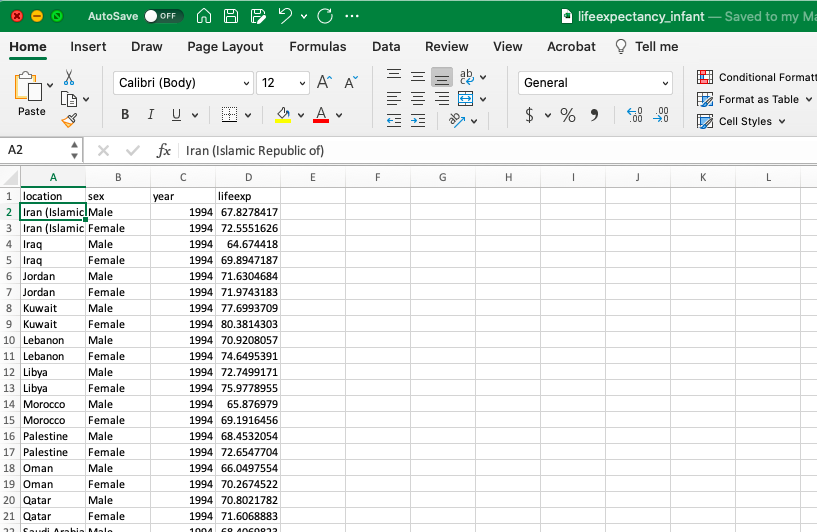
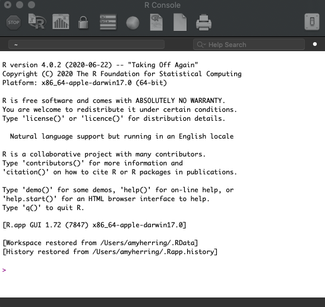
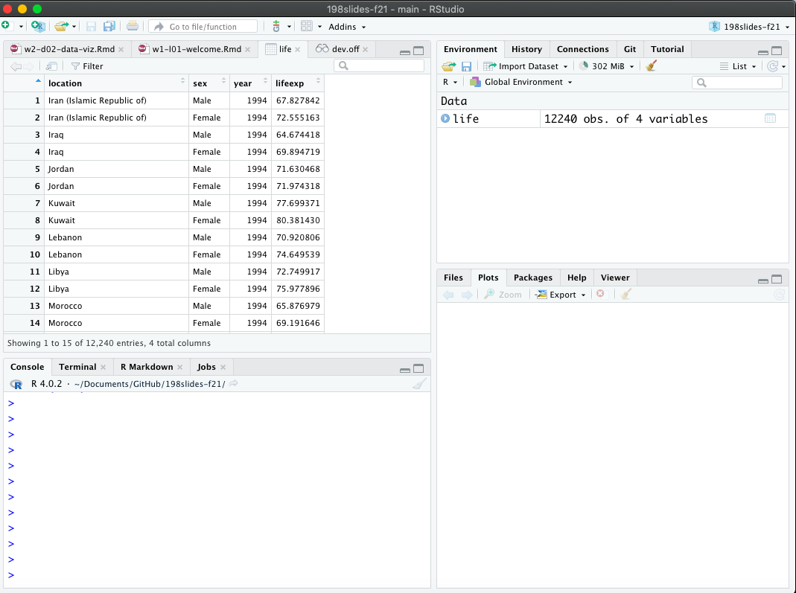

## Data science {.small}

- Data science is an exciting discipline that allows you to turn raw data into understanding, insight, and knowledge. 

- This is a course on health data science, with an emphasis on statistical thinking and global health challenges

- Our process involves

  - forming a question of interest,
  - (collecting) and summarizing data,
  - and interpreting and communicating results. 

## Global health data science

STA/GLHLTH 198 will

- provide a tour of basic statistical methods useful in public health and biomedical research

- emphasize intuition and understanding of the methods, with a focus on critical assessment of evidence, data-driven decision-making, and effective communication of insights from data

- make use of timely, relevant examples from global health science, with opportunities to think about what makes us human

- utilize free, modern software and reproducible research methods for transparency and data sharing


## Frequently Asked Questions

::: {.incremental}

- **Q:** What data science background does this course assume?  
  **A:** **None.** No prior experience with data science or programming is expected.

- **Q:** Is this an intro statistics course?  
  **A:** Statistics and data science are closely related, with substantial overlap. This course is an excellent way to begin learning statistics, but it is **not** a traditional high school statistics course.

- **Q:** Will we be doing computing?  
  **A:** **Yes—extensively.** Computing is a core part of the course and an essential tool for learning data science and statistics.

:::

---
title: "Software"
---

## Software

:::: {.columns}

::: {.column width="70%"}

```{r}
#| echo: false
#| out-width: 75%
#| fig-align: left


```

:::

::: {.column width="30%"}

We'll combine the ease of viewing in Excel with ...

:::

::::

## Software

:::: {.columns .v-center}

::: {.column width="70%"}

```{r}
#| echo: false
#| out-width: 60%
#| fig-align: left


```

:::

::: {.column width="30%"}

the rigor of the R programming language ...

:::

::::

---

## Software

:::: {.columns .v-center}

::: {.column width="70%"}

```{r}
#| echo: false
#| out-width: 73%
#| fig-align: left


```

:::

::: {.column width="30%"}

in an integrated environment. To learn more, check out the
[introductory video](https://warpwire.duke.edu/w/7WsIAA/)
for our computing toolkit.

:::

::::

## The data science life cycle


---
class: middle
---

# Let's dive in!

## Life Expectancy

- The [Institute for Health Metrics and Evaluation (IHME)](http://www.healthdata.org) is a resource for data on a variety of important health outcomes worldwide.

- IHME maintains the [Global Burden of Disease (GBD)](http://ghdx.healthdata.org), a valuable resource for policymakers and others that quantifies health loss due to a variety of risk factors, diseases, and injuries.

---

## Life Expectancy


- We consider data from IHME on (estimated) infant life expectancy from the years 1994–2019 as a function of location (primarily country) and binary gender.

- Here **life expectancy** is the \# of years an infant can expect to live if mortality rates in the current year remain unchanged for the rest of their life. Life expectancy usually underestimates how long the baby will actually live because mortality rates have been declining over time.

---

# What is in a dataset?

---

## Dataset terminology

- Each row is an **observation**
- Each column is a **variable**

::: {.small}

```{r}
#| message: false

life <- readr::read_csv("../data/lifeexpectancy_infant.csv")

life
```

:::


## Imagine this dialogue {.small}

. . .

[**Campaign manager**]{style="color:blue;"}: What is the probability that our candidate wins the election?

. . .

(A flurry of analysis takes place.)

. . .

[**Data scientist**]{style="color:red;"}: Our best guess is 54%.

. . .

[**Campaign manager**]{style="color:blue;"}: How reliable is that estimate? How confident are we in that? What's the margin of error?


. . .

::: columns
::: {.column width="50%"}

**Parallel Universe 1**

[**Data scientist**]{style="color:red;"}: It's 54% give or take 3%.

:::

::: {.column width="50%"}

:::  {.fragment}

**Parallel Universe 2**

[**Data scientist**]{style="color:red;"}: It's 54% give or take 20%.

:::

:::
:::

. . .

::: callout-note
## It's all about decision-making under uncertainty

The manager is going to make wildly different decisions about campaign strategy and spending depending on how uncertain the environment is.
:::


## Questions? {.larger}

# Syllabus highlights

## Homepage

[https://fall-2026-global-health-data-science.github.io/stat-fun/index.html](https://fall-2026-global-health-data-science.github.io/stat-fun/index.html){.uri}

-   All course materials
-   Links to Canvas, GitHub, RStudio containers, etc.

## Course toolkit

All linked from the course website:

-   GitHub organization: [github.com/Fall-2026-Global-Health-Data-Science](https://github.com/Fall-2026-Global-Health-Data-Science)
-   RStudio containers: [cmgr.oit.duke.edu/containers](https://cmgr.oit.duke.edu/containers)
-   Communication: Ed Discussion
-   Assignment submission and feedback: Gradescope

## Activities {.smaller}

-   Introduce new content and prepare for lectures by watching the videos and completing the readings
-   Attend and actively participate in lectures (and answer questions for participation credit) and labs, office hours, team meetings
-   Practice applying statistical concepts and computing with application exercises during lecture
-   Put together what you've learned to analyze real-world data
    -   Lab assignments
    -   Quizzes
    -   Exams

    
## Grading {.smaller}

| Category              | Percentage |
|-----------------------|------------|
| Lectures (attendance + participation) | 10%         |
| Labs                  | 15%         |
| Midterm 1                | 25%        |
| Midterm 2                | 25%        |
| Midterm 3               | 25%        |
| Final                 | Replace lowest midterm        |

See course syllabus for how the final letter grade will be determined.

## Wiggle room

- After Drop/Add, you can miss 4 of 22 lectures and still receive full attendance credit;
- We drop the two lowest labs;
- We drop the lowest homework;
- We replace the lowest midterm score with your final exam score (if it’s better; otherwise the final does not affect your grade).

## Attendance and participation {.smaller}

-   Daily in lecture

-   Tracked for credit, but not based on correctness, only participation (often questions designed to make you think that might not have a single right answer!)


## Labs {.smaller}

-   Hands-on practice with data analysis

-   A single exercise per lab, graded based on being there and turning in something reasonable + correctness

-   Completed in-person, in lab, in teams

-   Teams randomized each week for roughly first half of course

-   Developed collaboratively, but turned in individually by the end of the lab session

-   Weekly throughout semester, two lowest scores dropped

-   No late work accepted


## Exams {.smaller}

-   Three in-class midterm exams during semester

-   Final (optional to replace lowest grade on midterm)

- No extensions or make-ups.

::: callout-caution
Exam dates cannot be changed, and no make-up exams will be given. If you can’t take the exams on these dates, you should drop this class or be comfortable with relying on the make-up exam.
:::

::: callout-note
## If you need testing accomodations
Make sure I get a letter, and make your appointments in the Testing Center now.
:::


## Teams {.smaller}

-   Randomized at first for weekly labs

-   Then selected by you or assigned by me if you don't express a preference for remaining labs

-   Expectations and roles
    -   Everyone is expected to contribute equal *effort*
    -   Everyone is expected to understand *all* code turned in
    -   Individual contribution evaluated by peer evaluation, commits, etc.


## Questions? {.larger}


## The data science life cycle


# Wrap up

## Silly exercise, serious themes {.scrollable .medium}

::: incremental
-   **Domain knowledge and modeling assumptions**: data do not speak for themselves. You need some subject-matter expertise about what you're studying, as well as an interpretive lens;

    - Not all models or assumptions are created equal!

-   Are you asking questions the data can actually answer?
-   Uncertainty has many sources, and in some cases, it may be simply irreducible, no matter how hard you try;
-   **Data quality and data cleaning**: Data are not gospel. There could be noise and mistakes. Then what?
-   **Wisdom of crowds**: aggregating many imperfect guesses can do better than any one individual guess.
:::

## This week's tasks

-   Attend lectures and lab:
    -   Computational setup;
    -   Getting to know you survey;
-   Read the syllabus and ask questions on Ed;
-   Complete readings and videos for next class;
-   Send me SDAO letters and schedule testing center appointments.

## Questions? {.larger}


